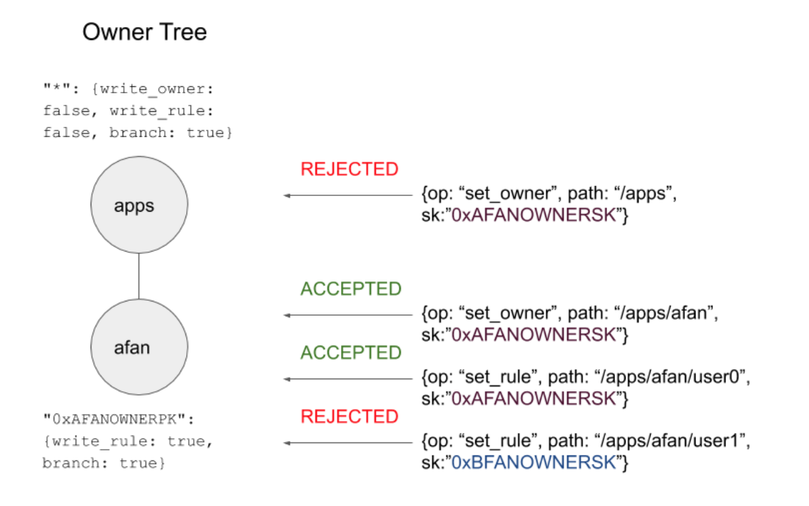
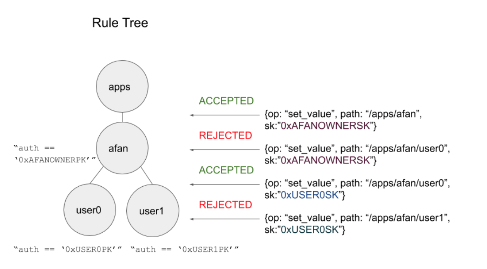

# Account and Keys

A private key uniquely determines a single AI Network address, also known as an account. 

The usage of accounts in AI Network is more than securing funds. AI Network uses the account for allowing only certain addresses which satisfies the rule in the database path can change the value. In general,  AI Network transaction is a request to access a particular database path with a particular account, and it requires a valid digital signature to be included in the blockchain. Anyone can verify that a transaction is valid, by checking that the digital signature matches the transaction details and the account to which access is being requested. 

When a transaction is sent to the blockchain in order to change the value at a specific path in the blockchain state, it needs to be sent with a digital signature created with the private key corresponding to an account who has the permission to write the value to the path. More specifically, permission of the database path is controlled by owner and rule which can be also modified by signed transactions. While owner permission at a path is granted by specifying certain actionable types \(i.e. branch, write\_rule, owner\_update\) to accounts, rules are more flexible and can be used with conditional statements. The details are covered in the rules section.

The following diagrams show how an application can utilize owner and rule for managing permission of an app. At first, the application owner can start from branching its own application path, and define rules for an application at subtrees. Some of the rules at subtree may state that the data can be only written by the users themselves, and even application owner cannot modify the user data.

Fig 1. \(1\) 0xAFANOWNERPK does not have write\_owner permission at “/apps. \(2\) 0xAFANOWNERPK has a branch permission at “/apps”, so it can start a new branch “apps/afan. \(3\) 0xAFANOWNERPK has a write\_rule permission at “/apps/afan”, so it can write rule at “/apps/afan/user0.” \(4\) 0xBFANOWNERPK does not have a write\_rule permission, so it cannot write a rule at “/apps/afan/user1.”

Fig 2. \(1\) 0xAFANOWNERPK has permission to write the value at “/apps/afan.” \(2\) 0xAFANOWNERPK does not have permission to write the value at “/apps/afan/user0.” \(3\) 0xUSER0PK has permission to write the value at “/apps/afan/user0.” \(4\) While 0xUSER1PK has permission to write the value at “/apps/afan/user1,” 0xUSER0PK does not have permission.

CAUTION: The private key must remain secret at all times. It must be backed up and protected from accidental loss. If it’s lost, it cannot be recovered and the funds and data secured by it are lost forever too.  
  
  

