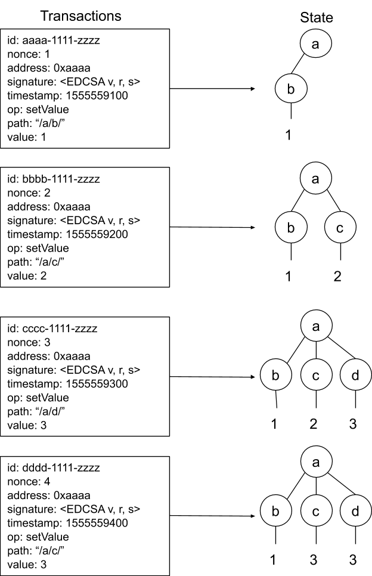

# States

AIN blockchain has tree-structured state models shared to all peers in the network. State consists of a collection of key-value pairs.

The state of the blockchain-database is determined by both the total set of transactions which have been added to blocks in the blockchain and all valid transactions in the transactions-pool which have not yet been added to blocks. This state determines what subsequent transactions are allowed, as well as containing information on all previous transactions and blocks that have occurred up to the current state.

Figure 1: Each new transaction builds upon the blockchain-database state that was left by the previous transaction. Each new transaction request is automatically assigned an ID and a nonce which is a +1 increment from the previous transaction. Additional transaction fields \(gas, parentTxID. etc,\) were omitted for space.   

