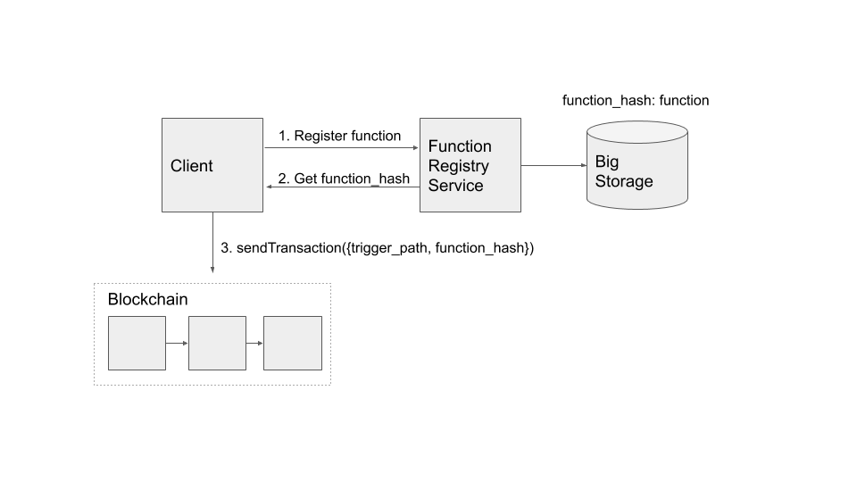
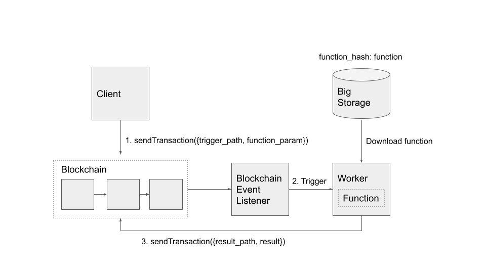

# Functions

An application may use AIN Functions to execute the backend-code in response to blockchain events. The code is stored in an off-chain repository \(a.k.a Big Storage\) and can be executed in the runtime environment of workers which are operated by diverse resource providers.  


Unlike conventional blockchain in which smart contract operations are synchronous and serialized,  AIN Functions can be executed asynchronously in parallel. The data used in functions are passed from the blockchain state, and the results are also passed back to the blockchain state after the operation is completed. The function typically does not remember any internal state during the execution, which means each function call is independent and stateless.  


AI Network may provide function registry service for a client to upload function programs to the off-chain repository. Uploaded functions can be accessible by function\_hash, and the set\_function transaction may be submitted to bind the corresponding path with the function. The function starts operation by setting the function parameters in the block state of the blockchain database, and each worker writes the execution result to the designated path. The path for the parameters and result may have an associated rule to control the permission for calling function and writing the result of the function.  
****



Fig 1. The function registry service receives the function code from the client and stores it in the big storage. In return, the client receives function\_hash which can identify the location of the function when the workers try to download the function before the execution. By recording a transaction which sets function\_hash for trigger\_path of the blockchain state, the registered function can be triggered when the parameters are written to the designated trigger\_path.  




Fig. 2 When the blockchain receives a transaction, the block state is updated by the transaction. The blockchain event listener monitors the change of block state and transmits the event to the corresponding worker. The triggered worker executes a function and generates an additional transaction as a result of the function execution. The additional transaction generated by the worker updates the block state, and may trigger other workers for the event.

#### Quick Demo

The following shows how simple Node.js function can be deployed using AI Network function registry service and event listener. It is also possible for developers to implement custom function registry service and event listener for processing different types of functions.

1.Register function to function registry service.

functions.ainetwork.ai currently supports Node.js 8. Developers can zip their project folder which includes index.js and package.json, and it will return function\_hash which can be used for registering the function to AI Network blockchain. index.js must exports onChange for the purpose of responding to a new blockchain transaction.


```javascript
exports.onChange = (event, context) => {
  const txData = event.data;
  console.log('hello', txData)
};
```


```bash
$ curl --upload-file ./hello.zip http://functions.ainetwork.ai
{
  result: {code: 0, message: 'success'}, 
  function_hash: 0xFUNCTION_HASH
}
```

2. Register function\_hash to blockchain database path. Developers may use custom registry\_service or event\_listener if they wish.

```javascript
ain.sendTransaction({
    operation: {type: "SET_FUNCTION", 
                ref: "path/to/value", 
                value: {registry_service: "functions.ainetwork.ai",
                        event_listener: "events.ainetwork.ai",
                        function_hash: '0xFUNCTION_HASH'}},
    nonce: 17,
    address: '0x11F26Fc7b19cB04eeAD03F3d32aeDf5A6e726dA6',
    parent_tx_hash: '0xd96c7966aa6e6155af3b0ac69ec180a905958919566e86c88aef12c94d936b5e'
})
.then(function(hash){ ... });
```

After this, hello function will be triggered whenever the value at the "path/to/value" is changed by a new transaction.

