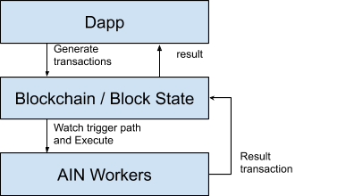

# Event-driven Architectures

  
AI Network works as event-driven application backend. The lifecycle of application request is as follows.

1. Client \(dApp\) sends transactions to blockchain
2. Block state of blockchain node is updated by the transaction.
3. Block state listener listens to the path and triggers event to the worker.
4. AIN workers executes functions for the path and may generate another transactions. If it generates another transaction it goes to \(2\) and updates block state.
5. Dapp registers listener to the blockchain data and gets result through the modified blockchain state.

In traditional server-based computing, users need to prepare the server, install OS and necessary drivers and software. Then, users need to manage servers and take care of hardware and software upgrades. To maintain highly-available and scalable servers, users also need to configure load-balancers. The idea behind serverless computing is for developers to focus on writing application code.

Figure1. AIN Triggers listen for value changes of specific paths in the blockchain state. When a trigger is invoked, AIN workers generate additional transactions as a result. These additional transactions may subsequently trigger other workers if necessary.  

