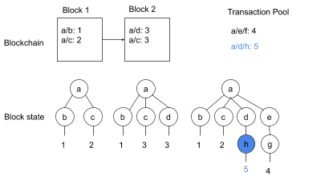
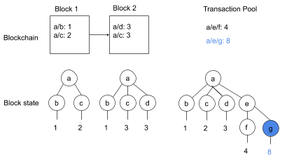

# Instant Execution, and Eventual Consistency

Our blockchain’s  approach to transactions and rules is unique to AIN network and unlike any other commercial blockchain implementation currently in use. In their simplest form transactions merely update values in a simple key-value tree-structured database, which is being maintained by the blockchain. Rules determine whether a given user has permission to execute a transaction, given information such as the user’s publicKey, the time of transaction, and other data in the database. Through these transactions and rules, the AIN Network achieves the following characteristic features:

1. Constant liveliness & instant execution
2. Guaranteed eventual consistency
3. Predefined consensus agreements

All peer nodes - as identified through their public key - maintain both a local copy of the blockchain, and a transaction pool to store transactions \(tx\) that have not yet been added to the blockchain. When a peer node receives a tx, they check the tx validity and then immediately execute this tx before adding it to their local transaction pool. These tx are subsequently added to blocks which then become part of the blockchain via the AI Network’s consensus mechanism \(Please refer to the consensus document for more information\). Blocks in the blockchain are identical across all peer nodes. However tx in the transaction pool will not necessarily be the same across all peers \(see Figure 1\). The “state” of the blockchain-database is formed from the sequential execution of all tx in both the blockchain and transaction pool. In this regard, the immediate execution of tx in the transaction pool allows the AI Network to provide constant liveliness to users, while the blockchain will ensure eventual consistency of state across all peers.

User  \(Public Key: Oxaaaaaaaaaa\)

User  \(Public Key: Oxbbbbbbbbbb\)  

Figure 1: Illustration of how transactions from both the blockchain and the transaction pool combine to create the state of the AIN blockchain database at any given time. Transactions in the blockchains are identical between the two nodes. However transactions in the transaction pool are slightly different, allowing for slight differences in state. These differences in both state and transactions in the transaction pool are highlighted in blue.  As transactions are removed from the transaction pool and added to the blockchain, consistency between states across all nodes will eventually be achieved.

This is illustrated in figure 1, where the “state” between nodes  with public keys 0xaaaaaaa and 0xbbbbbbbbbb are slightly different. This difference in state arises from differences in transactions between 0xaaaaaaa’s and 0xbbbbbbb’s ’s transaction pools. Assuming these transactions are valid, these differences between the two states will eventually be reconciled when the valid transactions in both 0xaaaaaaa’s and 0xbbbbb’s respective transaction pool get included into a block on the blockchain, 

Rules will be used to enforce predefined consensus agreements about what type of transactions will be allowed. Paths under, the rules subtree of the database determine access privileges to data at the corresponding path under the root tree for the blockchain-database “state”.  

