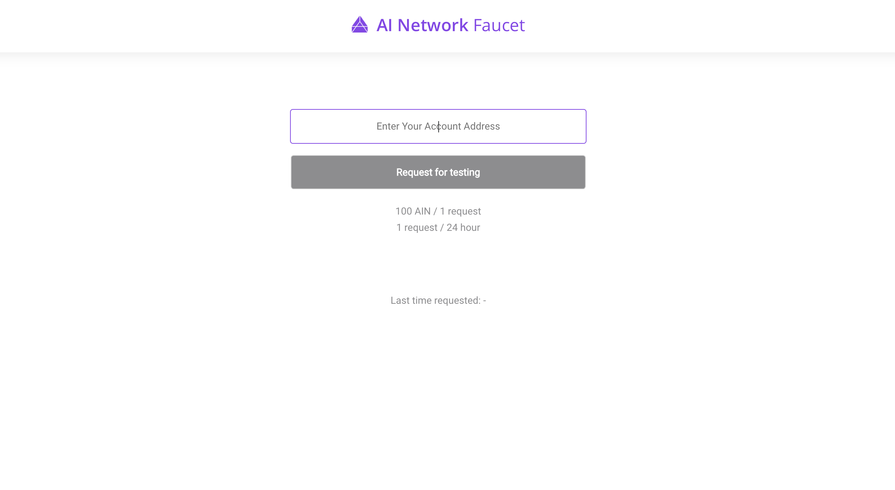
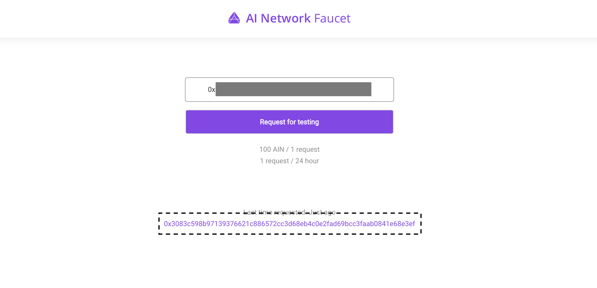

# Quick Start

Before following this guide, you should have a Node.js project set up.

## Step 1. Install ain-js

[ain-js](reference/blockchain-sdk/ain-js/) is a JavaScript SDK that can be used to send requests to and get responses from the AIN blockchain through its JSON RPC API. It's published on the npm registry and can be easily installed with the following command.

```text
npm install @ainblockchain/ain-js
```

## Step 2. Connect to a test node

The AI Network Dev Team is currently exposing a public Testnet node at http://node.ainetwork.ai:8080. In the future, there will be more nodes to connect to.


```javascript
const Ain = require('@ainblockchain/ain-js').default;
const ain = new Ain('http://node.ainetwork.ai:8080');
```


## Step 3. Create an account

ain-js can create accounts for you. Just specify the number of accounts you want to create.


```javascript
const account = ain.wallet.create(1);
const myAddress = account[0].address;

// Set myAddress as the default account
ain.wallet.setDefaultAccount(myAddress);
```


## Step 4. Get AIN \(for free!\)

We have a faucet site that gives you 100 AIN per day \(valid only on the Testnet\). Follow this link [http://faucet.ainetwork.ai/](http://faucet.ainetwork.ai/) and enter `myAddress` that you created from Step 3 at the input field. Click "Request for testing" and voilà! Now you have 100 AIN in your wallet, just like that. 



You can check out the details of the transaction that transferred the fund from our reserve to your address by copying the transaction hash \(the purple string that starts with 0x...\) at the bottom of the page and searching it on AI Network's block explorer site [https://insight.ainetwork.ai/](https://insight.ainetwork.ai/).



## Step 5. Transfer AIN

You can transfer the AIN you received from Step 4 with a `transfer()` function. You need to specify the to \(the address you're transferring the AIN to\) and the value \(how much AIN you're transferring\). 'from' is optional if you've set the default account. If you have not, you should set 'from' as the address you're transferring AIN from.


```javascript
ain.wallet.transfer({
    from: myAddress, // If you followed Step 3, you can omit this line
    to: <other-address>,
    value: <some-numeric-value>
})
.then(res => {
     // The returned value will be either
     // { result, txHash } or { code, message, txHash },
     // depending on the result of the transaction.
});
```


## Step 6. \(Optional\) Setting the nonce of your transaction

Optionally, you can set the nonce of your transaction. In Step 4, we didn't set the nonce value, which means that ain-js automatically set the transaction's nonce as -1. A transaction with a nonce of -1 is regarded to be "loosely ordered" and is ordered based on its creation time.

Call `getNonce()` method to get the current nonce of your address and make a same transfer call as in Step 4, but with a nonce that's incremented by 1 from the value you just got from `getNonce()`.


```javascript
ain.getNonce({ address: myAddress })
.then(nonce => {
      ain.wallet.transfer({
         from: myAddress,
         to: <other-address>,
         value: <some-numeric-value>,
         nonce: nonce + 1
     })
     .then(res => {
          // The returned value will be either
          // { result, txHash } or { code, message, txHash },
          // depending on the result of the transaction.
     });
});
```



