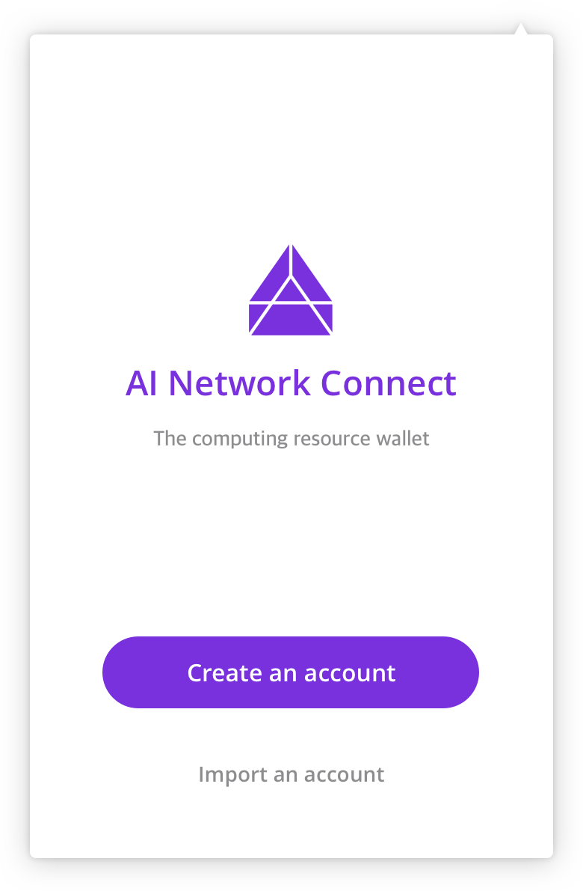
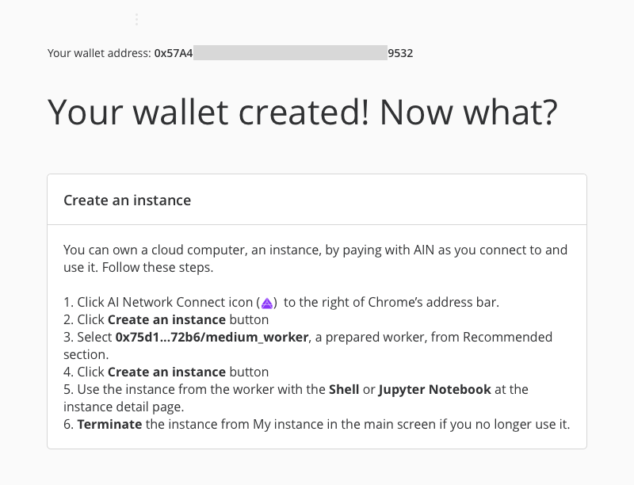
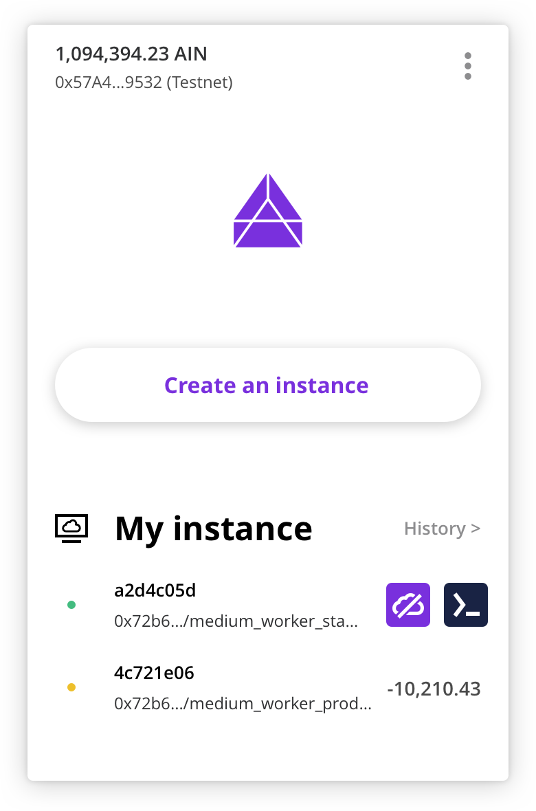
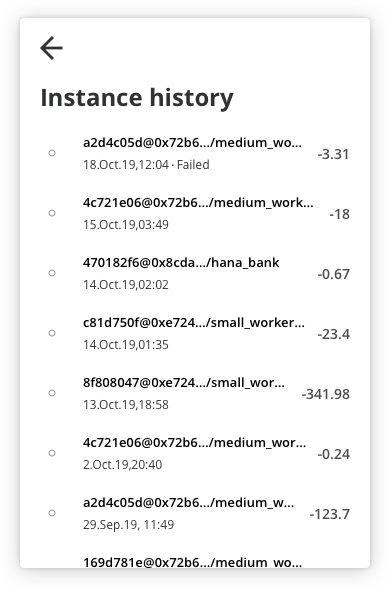
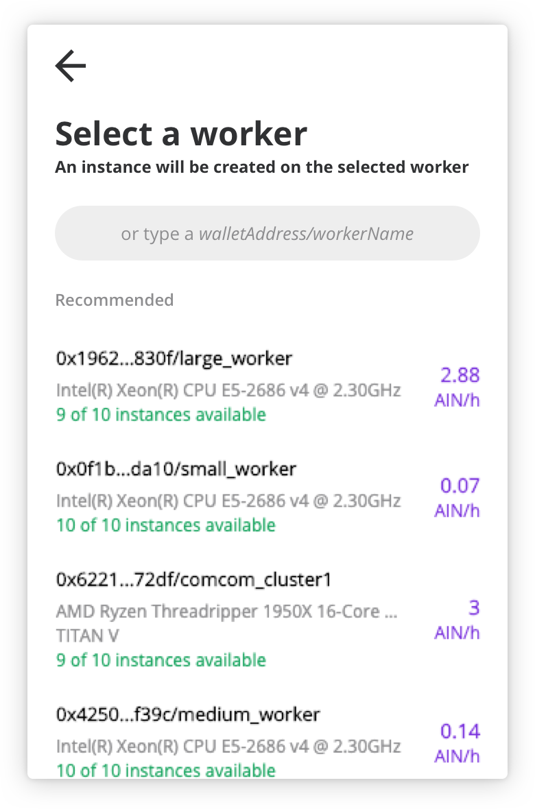
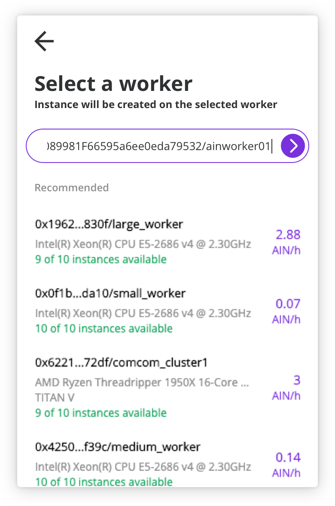
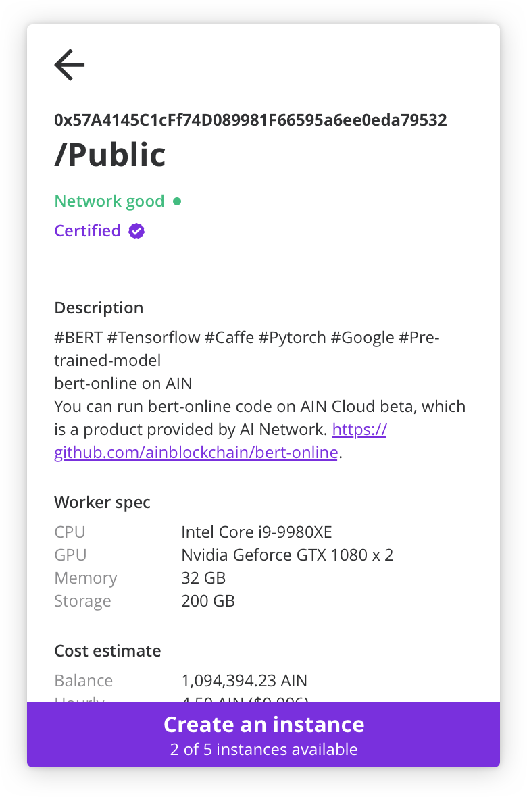
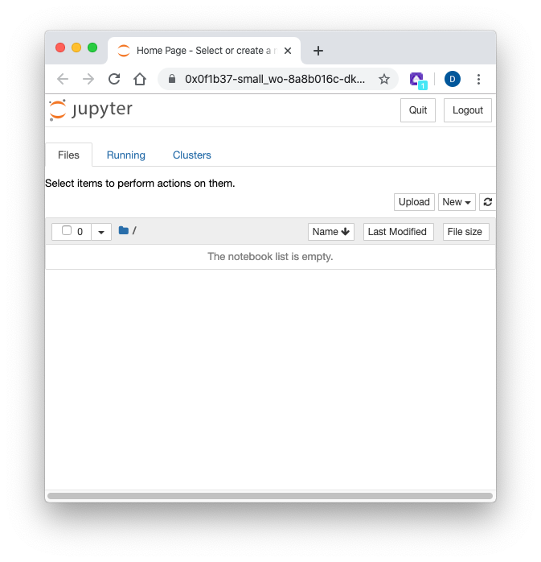

# AI Network Connect

AI Network Connect, or simply “AINconnect”, is a browser extension that allows you to manage accounts and computing resources on AI Network. You can download it at [connect.ainetwork.ai](http://connect.ainetwork.ai).

AINconnect is currently at Beta. We can't guarantee stability nor quality of the service during beta.

## Getting started

Click the AI Network icon\(\) on your browser's extension list to get started. 

#### Create an account

Click 'Create an account' and go though the process. Backup and do not lose the recovery-phrase provided. 

Once you successfully create an account, you will see the following screen in a new tab. There you can find how to create an instance and use Shell or Jupyter Notebook within it. Give it a try.

#### Import an account

If you already have an AI Network account, Click 'import an account' and enter a recovery-phrase to restore your account.

## Main screen

In the main screen, following information and features are provided.

* **Account and balance:** On the top left corner, you will find your AI Network account address \(in an abbreviated format\) and the AIN balance of your account.
* **Create an instance:** This button creates an instance from a worker on AI Network. 
* **My instance:** This section shows you the instances you have created. You can check their status, the instance IDs, the addresses of workers hosting the instances, and the cumulative costs since their creation. In addition, we have following features:
  * **Instance details**: Click an instance to see the details of the instance. 
  * **Mouse over button \(Fig. 4\)**: Hovering your mouse pointer on an instance will reveal two buttons–the one on the left terminates the instance, and the one on the right shows the app that you've recently run \(Shell is default\).
  * **Instance history \(Fig. 5\)**: Click 'History &gt;' to see the previously used instances.

* **Menu:** is accessible via \(\) on the top right corner. 
  * Lock now: locks AINconnect immediately. You have to enter your password to unlock it again.
  * Settings: Automatic lock time settings, Recovery-phrase, Active network, and Reset can be found here. 
  * Report an issue: Click this if you have an issue to report or any inquiries to the AINconnect dev team.
  * Info & Help: You can find the version, initial guide, Terms and other information.

## Creating and utilizing an instance

With just these 3 steps, you can create a computing instance on a remote hosting machine.

### **1. Select a worker**

Once you click the "Create an instance" button from the main page, you'll encounter a list of workers \(fig. 6\). View the information of workers and select a worker to create an instance on. If you want to select a specific worker, enter its address into the textfield \(fig. 7\). 

### **2. Click 'Create an instance' button**

You will see more information of the selected worker on the worker detail page \(fig. 8\). Click the 'Create an instance' button on the bottom of the page to proceed.  
If you see the 'Running' status at the instance detail page \(fig. 9\), it means the instance has been successfully created.

### **3. Utilize the instance with Shell or Jupyter Notebook**

Every instance created with AINconnect is equipped with Shell \(fig. 10\) and Jupyter Notebook \(fig. 11\) inside. Click the icons on the instance detail page to use the features within your instance.

