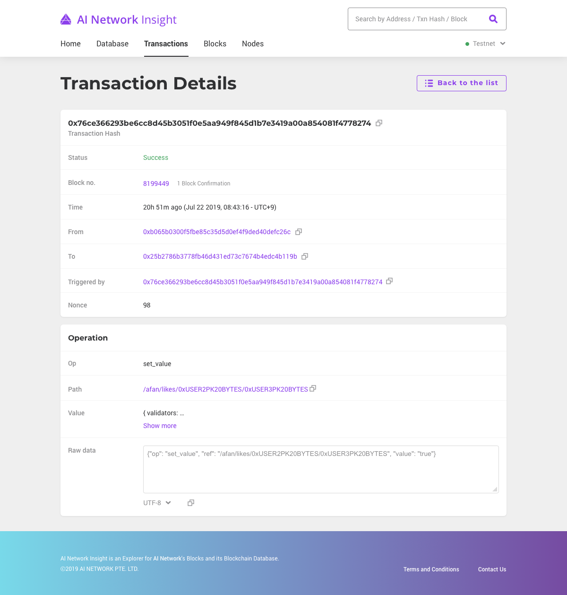
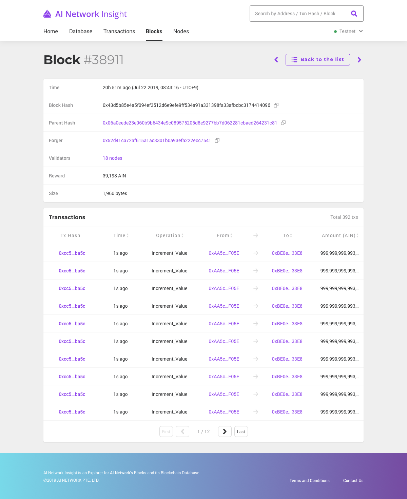
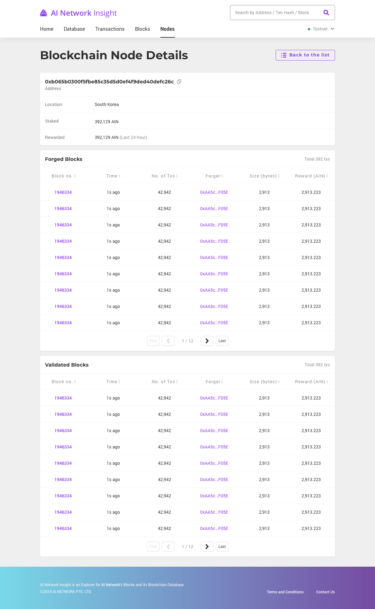
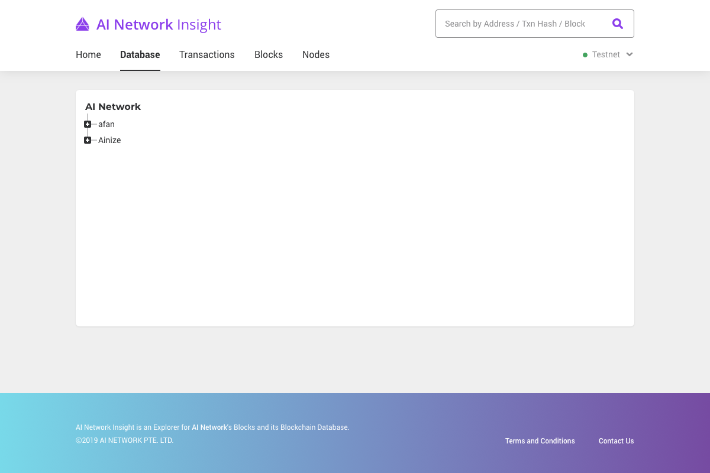

# AI Network Insight

AI Network Insight\([insight.ainetwork.ai](https://insight.ainetwork.ai)\)is an Explorer for AI Network’s Blocks and its Blockchain Database. AI Network Insight allows users to monitor and explore transaction data and block data in the AI network. 

## Features and Components

### Menu

The AI Network Insight menu bar allows users to browse and explore information from the AI Network.

* **Home:** shows an overview of essential AI Network information.
* **Database:** shows data in the AI Network blockchain database in a tree-structured format.
* **Transactions:** shows information on AI Network transactions.
* **Blocks:** shows information on blocks created by AI Network's Blockchain Nodes.
* **Nodes:** shows information about Blockchain Nodes on the AI Network.

### Search

The AI Network search bar in the top-right corner allows users to search for information about account, transactions and blocks. The accepted search keyword types and formats are as follows:

* **Address**

  * 42 characters long
  * Starts with a prefix `0x`
  * Hexadecimal numbers only \[0~9, a~f\]

* **Transaction Hash**

  * 66 characters long
  * Starts with a prefix `0x`
  * Hexadecimal numbers only \[0~9, a~f\]

* **Block**
  * Decimal numbers only \[0~9\]

Invalid search keywords, or searches which return no results will result in an error page.

### Network selector

Users can select a network to view using the dropdown menu located below the search bar. 

## Home 

The Home page gives users an an overview of information from the AI Network. This information includes block height, 24h-average block generation time, current price of AIN coin, 14-day transaction history, and 24-hour TPS\(transactions per second\) history.

### **Network status**

* **Block Height:** shows how many blocks have been created since the genesis.
* **24-hour average block time:** shows the average time for generating a new block over the last 24 hours
* **AIN price:** shows the latest price of AIN coin. The exchange rate is from GOPAX \(as of Sep. 2019\).

* **14-day transaction history:** displays a graph of the daily number of transaction trends over the last 14 days. You can find today's number of transactions above the graph by default. If you move your mouse and hover over a date, the number of transactions for that date is displayed as below.
* **24-hour TPS history:** displays a graph of hourly average TPS\(Transactions Per Second\) over the last 24 hours. You can find the latest average TPS above the graph by default. If you move your mouse and hover over a time, the TPS of that time is displayed as below.

### 

### Blockchain node

AI Network Insight also provides information on the blockchain nodes. You can find the address of a node, the number of blocks a node proposed and validated, the location of a node, the amount of AIN coins a node staked, and the amount of AIN coins a node has been rewarded over the last 24 hours. A lot of this information is related to the PoS \(Proof-of-Stake\) consensus protocol used by the AI Network blockchain. By default, this section allows you to see the top 10 nodes sorted by the amount of staked AIN coin. Click the 'View all' button on the upper-right of the list to view information on all nodes. Detailed descriptions of each column can be found at **Blockchain Node Details**

### 

### Latest Blocks & Transactions

The essential information of the latest blocks and transactions can be found at the bottom of the Home section. For more details, click the number of a Block or a Tx \(Transaction\) Hash. Click the 'View all' button on the upper-right of each list in order to see the whole list. A detailed description of each column can be found at **Block Details** and **Transaction Details**.

## Transactions

All executed transactions are listed here.  

Clicking a Tx Hash link opens a separate page, detailing all information for the Tx Hash.

### Tx Hash / Transaction Hash

Tx Hash stands for transaction hash.  These Tx Hashes act as unique IDs for  each transaction. Since Tx Hashes are  66-character-long-strings, the middle part of a Tx Hash string is abbreviated as '...' for easier readability.

* Example: 
  * Original Tx Hash: 0x310530808edd44c7b3f2c890f06115dc2f23ad137dca73f0b287e69576775d76
  * Abbreviated Tx Hash: 0x3105...5d76

### Status

Status lets you know if a transaction is successfully included in a block and if the block has been confirmed as added to the blockchain. There are three possible statuses:

* **Success:** The transaction has passed the related [rule](https://ai-network.gitbook.io/ai-network/ai-network-design/state-rules-and-functions/rules), executed, correctly ordered with other transactions, and has been included in a confirmed block block on the blockchain.
* **Pending:** The transaction is in the transaction pool, or there is some network issue\(e.g. network latency\)
* **Fail:** The transaction has failed validation and will not be included in the blockchain. This can happen for the following reasons:
  * In case of failing to pass the rule.
  * In case of wrong ordering.
  * In case of an invalid nonce.

### Block no.

This is the number \(or height\) of the block on the blockchain containing the transaction. In the list view, an icon notifying an error appears  if the transaction is not successfully included in any block. In the detail view window, the number of blocks that have been confirmed since the transaction is displayed.

### Time

Gives time information on when a transaction was created. 

### From / To

The addresses of who sent and received the transaction. Click the address to see more details of the account.

### Triggered by

A transaction can be triggered by another transaction. This is the hash of the triggering transaction. This will remain empty if the transaction has not been triggered by any other transaction.

For example,

1. User1 can assign a  machine learning job to peer1.
2. After peer1 completes the job, the job data is written to the database database via transactions.
3. When all job data has been written to the database, this may result in a 'job-done' transaction, which can be sent to the network to indicate that peer1 has completed their work.
4. This "job-done" transaction confirms the result, and indicates that AIN coin payment should be sent to  peer1.
5. This payment transaction is triggered by the 'job-done' transaction.
6. The job is complete.

### Nonce

The number of the transaction added by the transaction creator to get a unique transaction hash. 

For more information, click [here](https://ai-network.gitbook.io/ai-network/ai-network-design/transactions/nonce).

### Operation

Specifies the type of database state-updating request. Operations consists of following components.

* **Op:** stands for operator. It sets and updates data or performs functions on the designated path. 
* **Path:** refers to the path in the blockchain database where data is being updated.
* **Value:** is used for the operator as a parameter. It could be a simple numeric or text value, or a lengthy function code.
* **Raw data:** shows the original data contained in the transaction. Op, Path, and Value are parsed from this. 

For more information, click [here](https://ai-network.gitbook.io/ai-network/ai-network-design/transactions/operations).

## Blocks

All created blocks are listed here.  

Clicking a block number link opens a up a new page giving more detailed information on the block.

### Block number

Block number is also known as block height. It tells you the number of blocks that came before a block.

### Time

Tells users when a block was proposed.

### Block Hash

Unique identifier of the block.

### Parent Hash

Unique identifier of the previous block.

### Proposer

The address of the node who proposed the block.

### Validators

List of validator addresses who participated in the consensus process for this block. Click the purple number of nodes to see the list of validators.

### Reward

The number of AIN coins rewarded for forging the block.

### Size

The size of the block in bytes.

### Transactions

List of transactions included in the block.

## Nodes

All blockchain nodes of AI Network are listed here.  

Clicking an address of a node opens a new page give more detailed information on that node.

### Address

Unique address of the node.

### Location

The country location for each node is determined according to the nodes IP address. It may be null if the node does not want to reveal their location, or if the IP address is unknown.

### Staked / Rewarded

The amount of staked and rewarded AIN. Staking AIN is required for any node to be a validator. Among all the validators, one single proposer is chosen to propose a block at each height of the blockchain. This proposer will be rewarded with AIN coin. The probability of being a proposer is proportional to the node's stake. 

For more details of consensus algorithm and staking, click [here](https://ai-network.gitbook.io/ai-network/ai-network-design/consensus).

### No. of Proposed / Proposed Blocks

The number and the list of  blocks proposed by a node. Click a block number for detailed information of the proposed block in the Proposed Blocks list.

### No. of Validated / Validated Blocks

The number and the list of blocks validated by a node. Click a block number for detailed information on the validated block in the Validated Blocks list.

## Database

shows data stored in blockchain database of AI Network in a tree-structured format. 

### 

### Database Tree

Expand or collapse a node by clicking a button with '+' or '-' icon. By expanding a node, lower-level nodes or properties of the node are revealed. 

### Database Details

Click a name of a node to see detailed information on the node.

* **Address:** On the upper side of the page, the address of the node is shown. All database nodes in the AI Network have their own url.
* **Breadcrumb:** is used as a navigational aid in exploring the AI Network Database. Click a purple node name link to see breadcrumb details.
* **Properties:** are displayed with property names and their values. If there are subordinate properties, an option to expand appears in front of the property name.
* **Highlights:** are shown on changed, added, deleted, or moved properties. If you want to see the latest highlights, click the 'Refresh' button on the upper-right corner.
* **Rules:** are javascript expressions which dictate which transactions are valid and accepted for the node. For more details, click [here](https://ai-network.gitbook.io/ai-network/ai-network-design/state-rules-and-functions/rules). 

